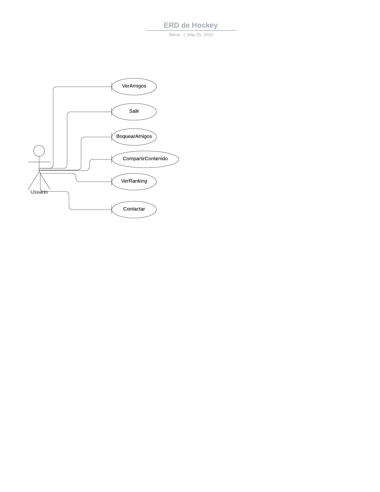

# Proyecto Aplicación Web

## Proyecto de diseño de una Aplicación Web para la asignatura Entorno de Desarrollo curso 2019-2020

> Nombre de la aplicación: Drink Party

> Nombre del alumno: **[Berny Jimenez](https://www.linkedin.com/in/berny-jiménez-7027a7177)**
# Sprint 4

## Diagramas de caso de uso 1

## Diagramas de caso de uso 2

